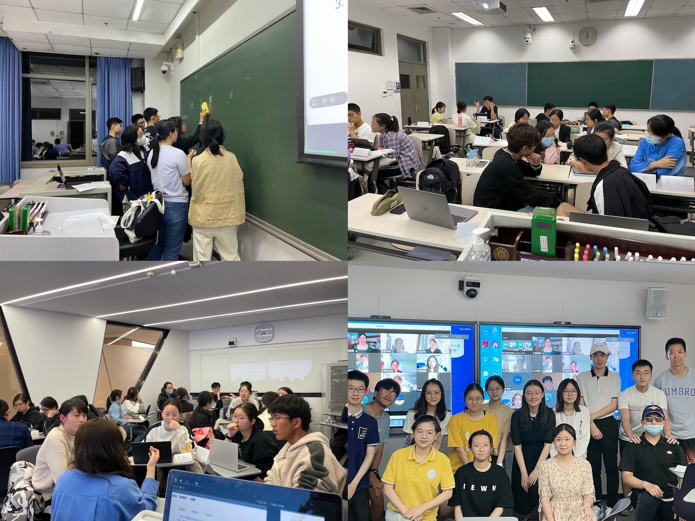

This is a weekly one-hour discussion forum for around 20 students per section.  

Some Business Cases
======
- Electicity Demand and Supply
- Private School Complusory Education
- Housing Market
- Wine Consumption
- Two-way Auction
- Carbon Transaction Market
- Steel Market
- Internet Regulatory

Some Student Feedbacks
======
- Interesting discussion with the class the Candice!
- I learned a lot with Candice's Encouragement!
- Candice is the warmest TA!
- Every class was well prepared and Candice is very considerate to us!
- Candice is very nice!
- Thank you so much Candice and you are so cute!
- So happy to stay with the class and Candice for a year! You are the best TA I met!
